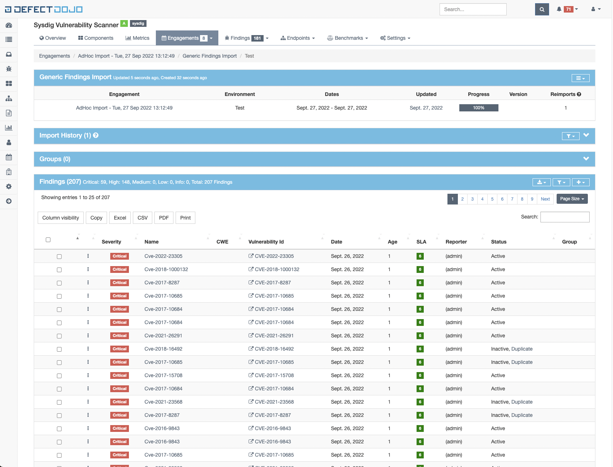
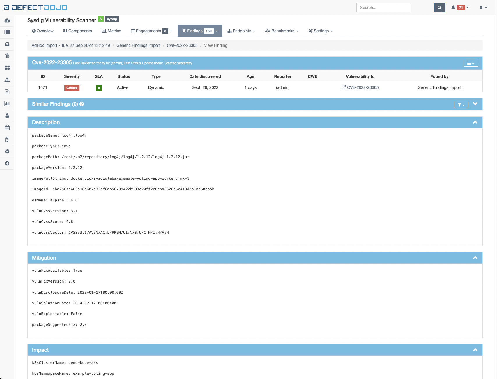

# sysdig-to-defectdojo

Quick & dirty tool to convert Sysdig vulnerability reports to Defectdojo.

You can use the [Defectdojo demo environment](https://demo.defectdojo.org/)

## Usage

* Create a JSON report in Sysdig UI (see [the official documentation](https://docs.sysdig.com/en/docs/sysdig-secure/vulnerabilities/reporting/) for more information)
* Download the JSON file
* Run `sysdig-to-defectdojo` with the following parameters
  * `-i`: input file path (the JSON file previously downloaded)
  * `-o`: output file path
  * `-t`: (optional) report name

 ```shell
python3 ./sysdig-to-defectdojo -i 20220927-....json -o output.json -t "My Sysdig Report"
```

* Upload the `output.json` file to Defectdojo as a [Generic Findings Report](https://documentation.defectdojo.com/integrations/parsers/#generic-findings-import)

* Profit!



